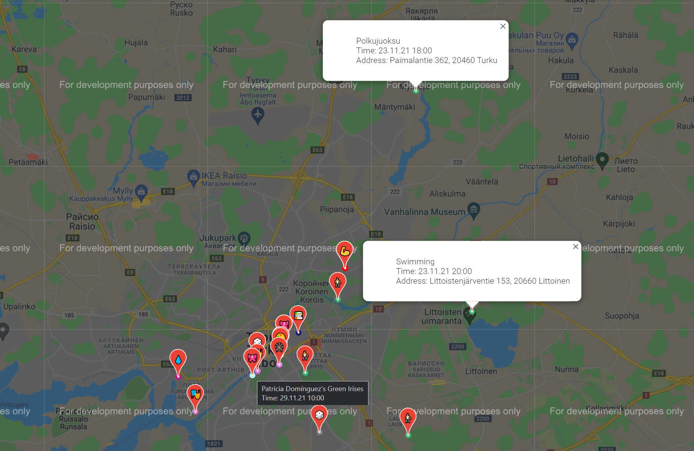

# TurkuLife
A map with the set of upcoming events in Turku City.

Motivation:
Current web maps only serve to show particular places without connection to upcoming events taking place in those venues and without proper filtration on the information, and types of venues. Although there are attempts to utilize maps to show future events, all those attempts are non-systematic and dedicated to a single place/organization.
The interactive map allows showing (uses Google maps at its core) all the events happening in the near future in the places where the upcoming event is going to take place. This helps people explore the social life in their neighborhood (important for elder people) and participate more actively in the city’s life. Different types of events are shown with different colors and necessary information can be accessed by hovering the mouse/finger (main info) or clicking on the pointer (details).
The information on the events will be aggregated from different sources, such as governmental websites, thematic communities in social media, and venue websites. The list of screened sources will be limited to the most reliable (10-30 sources).
The information once aggregated will be stored in the secured database and can be utilized for further analysis to research inter-region differences, report data, and plan organizational changes.

In this script we show how we can utilize the data on the upcoming events to integrate the interactive map into the app prototype created to inform Turku citizens and visitors on upcoming events.

We load a list of different types of events that were collected from different reliable sourses. Both APIs and requests are utilized to collect data and form the database (csv file in this demonstrative example).
The script includes map configuration. We define the types events, popup and on-click windows templates, color and label dictinaries.
On the map we show the information on the upcoming events and venues. Hovering mouse/finger next to the pointer shows the basic information, clicking on the event shows more details. Colors of dots / labels on pointers are selected according to event types.

Note: you need to input your google maps API key into 'key' file next to the script. For more information on Google maps API: https://developers.google.com/maps/documentation/geocoding/get-api-key

For more information on the project see: https://docs.google.com/document/d/13oTHdf4OECJiRPGcbx-3KOHWM1PB6sHP5Sln7sGCDWU/edit?usp=sharing

